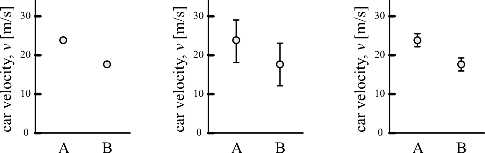
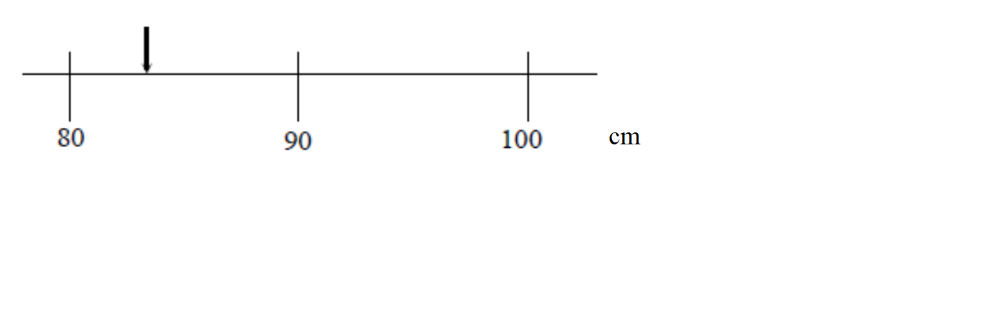
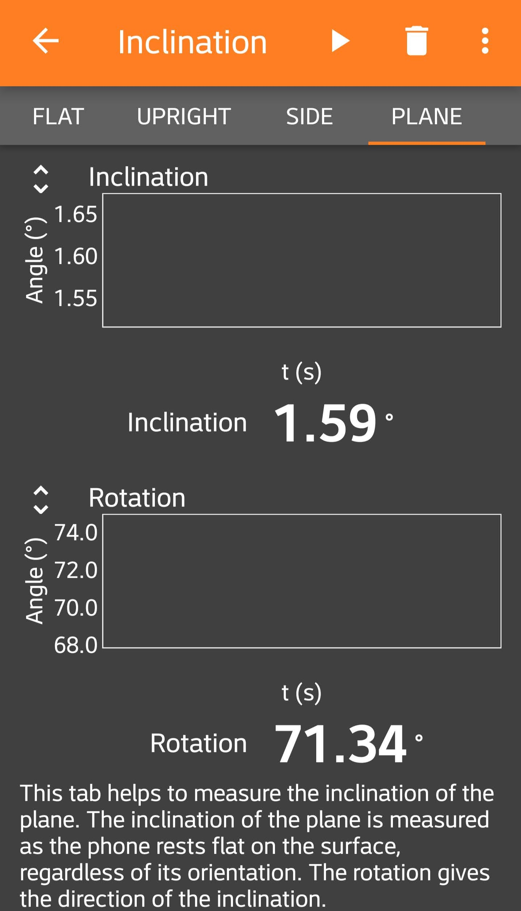
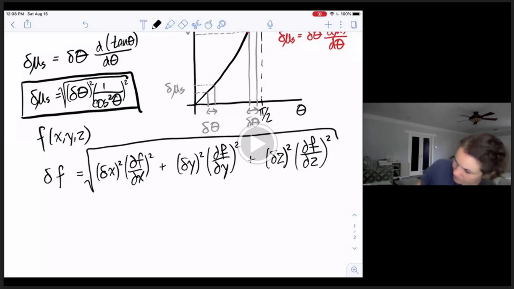

# Uncertainty Introduction

- [Overview](#overview)
- [Sources of Uncertainty](#sources-of-uncertainty)
    - [Resolution Uncertainty](#resolution-uncertainty)
    - [Random Uncertainty](#random-uncertainty)
    - [Systematic Errors](#systematic-errors)
- [Combining Uncertainties](#combining-uncertainties)
- [Propagation of Uncertainties](#propagation-of-uncertainties)

## Overview

Estimating the uncertainty of our measurements enables us to make conclusions from our data. For example, imagine you measured the speed of two passing cars (car "A" and car "B") in three different ways:

In panel (i), the measured velocities of cars A and B are reported, but we are given no indication of how certain we are about the results from those two measurements. It's difficult to draw a conclusion from this type of data because we don't know how confident we are about the two data points. 

Instead, if the values are reported with their uncertainties as in (ii), the error bars (the vertical lines around each data point) give an indication of how confident we are that the actual speed for each car falls within a range of values. In this example, the velocity of car A is reported as $$v_A = 23 \pm 5\,\mathrm{m/s}$$ and the velocity of car B is $$v_B = 18 \pm 5 \, \mathrm{m/s}$$. Because the error bars are relatively large compared to the difference between A and B in (ii), we might conclude the following: *"The speed of A and B was measured to be similar and their difference was within the experimental uncertainty of $$\pm$$ 5 m/s."* In other words, the experiment was not sensitive enough to tell the difference between the speed of A and B. 

If we had used a more sensitive experimental technique, that would give a smaller uncertainty as in (iii). This smaller experimental uncertainty lets us make a more powerful conclusion: *"The velocity of car A was measured to be faster than that of car B, with $$v_A = 23 \pm 2\,\mathrm{m/s}$$ and $$v_B = 18 \pm 2 \, \mathrm{m/s}$$.* By minimizing sources of uncertainty in our experiments and providing accurate estimates of how large the uncertainties are in our measurements, we are able to make strong conclusions about our experiments.

That's our goal as experimental scientists: to make strong conclusions based on our data. To do this we need to try to minimize the uncertainty when we perform a measurement. We must be aware of how much variance there is in our data and how to quantify that variance. We want to be aware of what factors in our experiment are introducing the most significant uncertainty and determine if there is some way we can improve our experimental design within our laboratory constraints. During an experiment you will need to ask yourself what factors could influence the result of your measurement. Each of these factors can be thought of as working against our having perfect knowledge about a “measurand” (the quantity we want to measure) and adding to the overall uncertainty. A crucial aspect of experimentation is to identify the most important sources of uncertainty and to numerically estimate their effect on your measurement result.

Common sources of uncertainty include:

+ your judgement in reading analogue instruments;
+ the sensitivity of your instruments (e.g. the digital scale, smallest interval on a meter stick, etc.);
+ the rating or stated calibration of the instrument;
+ approximations and assumptions that you make while doing the experiment;
+ variations in repeated readings made under apparently identical conditions; and
+ the effects of environmental conditions on the measurement.

A measurement uncertainty is not meant to be an indication of “mistakes” that you might make in an experiment. If you are aware that you have made a mistake, then you should repeat your experiment or at least exclude the data taken improperly. Similarly, “human error” is not a useful way of identifying a source of uncertainty; that phrase provides future experimenters with no guidance at all about what aspects of the experimental apparatus or procedures to focus on improving.

## Sources of Uncertainty
There are many sources of uncertainty in your experiment, but not all originate in the same manner and therefore there are different methods of accounting for them.  When designing an experiment the aim is to make the uncertainty small enough to achieve the experiment’s goal — or often, to make the uncertainty as small as possible in order to observe as much detail as possible about the phenomenon.  However, always keep in mind that the uncertainty can never be reduced to zero, just made small and honestly estimated.

### Resolution Uncertainty
Imagine you are attempting to measure the length of an object using the meter stick shown at the right. The length of the object is more than 80 cm but it is less than 90 cm but we are clearly limited by the resolution of our measuring device:

We now get a better measuring device that has graduations down to the cm. We can now say that the length of the object is between 83 and 84 cm, although it appears to be closer to the 83 cm mark. Again, the accuracy of our measurement is limited by the markings on the meter stick:

Finally, we obtain a measurement device that can measure much smaller intervals than our previous devices, surely we can now know the “exact” length of our object, right? As we see when we zoom in our measurement still could be improved by increasing the resolution of our measurement device!!

Apparently even with our super device there is a limit to the knowledge that the we can gain about the length of the object. All we can say is that the length of the object is between 83.4 and 83.5 cm. Even if we use smaller and smaller divisions on our meter stick our knowledge about the length of the object will never be perfect. This type of uncertainty is called the resolution uncertainty. A general rule of thumb is that the resolution is half of the smallest digit a device can measure, but it may be much greater than this if other known factors are limiting your uncertainty (perhaps you can’t get your ruler close enough to make an accurate measurement or can’t really tell where the object you are trying to measure begins or ends). Estimating uncertainties requires more than rules of thumb, it also requires judgement and common sense.

In the context of our online Ph50 course, you will use a ruler to measure distances in Module 3. In Module 2, you will measure the movement of an object in a video. In that module, your resolution uncertainty will come from the uncertainty in measuring the location of the object (in pixels) and the uncertainty in the time at which each frame of the video occurs (in seconds). 

For Module 1, you are using a digital readout of the angle of inclination from the phyphox app on your phone: 

Similar to the ruler, a good estimate of the resolution uncertainty is half of the last digit reported in the digital readout. In this example, we have measured $$\theta=1.59\,^\circ$$ with a resolution uncertainty in the angle of $$\delta_\mathrm{res.} \theta = 0.005 \,^\circ$$.

[*Return to Module 1 Week 1*](week1#1-perform-a-single-measurement)

-------------------------------------------

Week 2 related reading:

### Random Uncertainty
If you attempt to repeat your measurement you most likely will observe some spread in your measured values (you do not get an identical measurement under “identical” conditions). There will be slight and uncontrollable differences from one trial to another. These uncontrollable differences generally arise from a huge variety of detailed causes. Maybe the air conditioning happens to blow a slight puff of air on your setup the first time. Maybe a speck of lint falls onto your setup. But, however these differences arise, they cause different results when a single procedure is repeated several times. The differences don’t trend in any particular direction, and their causes are subtle and hard to identify, let alone control, in the lab – so we call them random. These variations in data cause a spread in your data.

To think through how we should treat these random uncertainties, let's look at an example thought experiment. Suppose we measure the length of an object using two different techniques/procedures, call them "Technique A" and "Technique B". Let's assume that Technique B somehow has more randomness in the measurement process (maybe the procedure for Technique B requires the experiments to occur in a dusty wind tunnel?). We can think of the experimental process as creating a theoretical probability density function with a mean $$\mu$$ and standard deviation $$\sigma$$. Each time we perform a single experimental measurement, we are sampling from these theoretical probability distributions, and suppose in our thought experiment they look like: 

Although the two techniques theoretically have the same mean value, Technique B has a larger standard deviation. This means that if we were to use Technique B for our experiment, we would be sampling from a broader probability distribution than if we used Technique A. 

So now let's start taking data in these two thought experiments. Suppose we took $$n=3$$ data points using each technique (with each point taken under “identical” experimental conditions), and looked at the number of times we measured each value of the length:

In these first 3 data points from each technique, we happened to have measured values between 83.4 and 83.5 cm. For each technique we calculate three important statistical quantities:

------------------------------

#### Sample mean
The sample mean is the sum of all the observed values divided by the sample size:

$$x_\mathrm{mean} = \frac{x_1 + x_2 + ... + x_n}{n}$$

#### Sample standard deviation
The sample standard deviation is (approximately) the root-mean-squared deviation of the observed values from the sample mean:

$$x_\mathrm{dev.} = \sqrt{\frac{ (x_1-x_\mathrm{mean})^2 +(x_2-x_\mathrm{mean})^2 + ... +(x_n-x_\mathrm{mean})^2}{n-1}}$$

Intuitively, the sample standard deviation represents a most likely range of values around the mean for where were would find our data. If we were taking one more data point, more than likely ($$\approx$$ 68% of the time if we are sampling from a Normal Distribution) we would expect to find that next data point within one sample standard deviation of the sample mean. 

*Tip: Google Sheets can calculate the standard deviation of your data for you by using the function STDEV().  You can read more on this [here](https://support.google.com/docs/answer/3094054?hl=en){:target="_blank"}. In MATLAB, you can use the [std function](https://www.mathworks.com/help/matlab/ref/std.html).*

#### Standard error of the mean (SEM)
The standard error of the mean represents the expected deviation of the calculated sample mean if many other samples of $$n$$ datapoints were taken. Intuitively, SEM reflects how confident we are that the sample mean is truly representative of the "actual" mean value of our distribution (what we called $$\mu$$ in our theoretical distributions; this actual mean value is also called the "population mean"). The standard error of the mean can be estimated from the sample standard deviation as:

$$\mathrm{SEM} = \frac{x_\mathrm{dev.}}{\sqrt{N}}$$

*For more information about the SEM, check out paragraph 130-131 and associated footnotes [of this document](images/Essentials-of-Statistical-Methods.pdf){:target="_blank"}.*

**Main point: our best estimate of our experimentally measured value is the sample mean, and our best estimate of its random uncertainty is the standard error of the mean. So only considering random sources of uncertainty, we would report $$x_\mathrm{mean} \pm  \mathrm{SEM}$$**

----------------------------------------

Returning to our example with $$n=3$$ for our two techniques, and looking at these at these three important quantities (sample mean, sample standard deviation, and standard error of the mean):

Let's compare our sample means ($$x_\mathrm{mean} \pm \mathrm{SEM}$$) with the actual mean ($$\mu = 83.5$$ cm). 

Technique: | $$x_\mathrm{mean}$$ [cm] | SEM [cm]
|:--------:|:------------------------:|:--------|
A | 83.477 | 0.015
B | 83.444 | 0.005 

Even though this data was obtained by sampling the two theoretical distributions, neither of these techniques results in a measured value within uncertainty of the actual mean. For example, Technique B gave us a sample mean value that is over 10 times the SEM away from the actual mean! What went wrong? We only used $$n=3$$ data points, which isn't enough to ensure that we are adequately sampling the distribution.

**Important: doing a statistical analysis on a small sample size is a bad idea. As a rough rule-of-thumb, take at least 6 data points before applying any statistical tools.** 

Let's repeat that same thought experiment, but now we will sample each distribution $$n=10$$ times (take 10 data points for each experimental technique):

Now we can see that Technique A has less variability than Technique B because the left histogram has more observations close to the same value. We also see from the summary statistics in the graphs that the sample standard deviations are close to that of the underlying distributions ($$x_\mathrm{dev.} \approx \sigma$$ for both). And most importantly, the sample means are closer to the actual mean value, with the SEM providing an adequate approximation for the uncertainty in the sample mean. 

We could continue this process of collecting more data points to try to reduce the random uncertainty. Here is the same two techniques but with $$n=100$$ data ponts:

By taking more data points, even with the experimental technique that had a larger variability, we were still able to end up with an accurate estimate of the mean, with an smaller esimated uncertainty from the SEM. Taking more data points results in reducing the random effects that pop up in our experiments, and makes our random uncertainty smaller.

But this reduced uncertainty comes at the cost of time. Performing a large number of trials takes a long time, and it's often not practical to repeat a measurement hundreds of times. There's also a diminishing return. If we increase the number of data points by 10 times, we only expect our random uncertainty (SEM) to drop by a factor of $$\frac{1}{\sqrt{10}}$$. As an experimentalist, we need to balance our desire for a strong conclusion with the time required to perform the experiment. 

Lesson check: If you take several trials of a particular measurement and record an identical value every time, does this mean you know the exact value with no uncertainty? What does this say about your experimental procedure?

 (think about it first, then click to expand/collapse) 
  Answer: 

If you recorded an identical value every time, then you would still have the uncertainty from the resolution uncertainty of your measurement device. Moreover, there might also be some systematic effect that you are missing (see discussion below). You should try to "reset" your experiment by taking down and re-setting-up your experimental apparatus. These small changes in how your apparatus is set up will lead to some random changes in the value you are measuring.

[Return to Week 2 - Test Repeatability](week2#3-test-repeatability)

-----------------------

### Systematic Errors

Systematic error arises when your experimental procedure and/or apparatus somehow cause all your measurements to be shifted away from the true value of the quantity you set out to measure. A systematic error happens in the same direction and the same (or similar) size in all your data, so its effect only shows up when an alternate measurement procedure is compared to yours.

For example, if you measure the length of an object with a meter stick that is 1.1 m rather than 1 m long (i.e. the spacing between mm marks is 10% too large) then all of your length measurements will be larger than those measured with a calibrated meter stick. Systematic errors are biases in the experimental process that need to be considered separately from resolution error and random uncertainty.  One good way to identify systematic error is to try several methods of collecting the same data.  If they should produce equal results (within resolution and random errors) but are consistently shifted from each other, then at least one method has a systematic error.  Another hint that you have a systematic error is to analyze your data for an expected shape or pattern.  If the basic pattern is what theory predicts but there is an offset, either the theory applies poorly to reality or you have a systematic error.  The best scenario is that you identify the source of systematic error and eliminate it from your process.  If that doesn’t happen, at least the size of systematic error can be estimated from careful checks like these.

[Return to Week 2 - Explore Other Factors](week2#4-explore-other-factors)

### Combining Uncertainties

When you make a measurement you will have both random and resolution (sometimes multiple!) uncertainties. In order to obtain one actual uncertainty to quote in your value you can combine the sources by adding in quadrature. Adding in quadrature means to square each value for your uncertainty, add them all together, and take the square root of the sum:

$$ \delta x_\mathrm{total} = \sqrt{\delta x_1^2 + \delta x_2^2 + \delta x_3^2 ...}$$

Where $$\delta x_\mathrm{total}$$ is the total uncertainty in the measured value $$x$$ and $$\delta x_1$$,$$\delta x_2$$,$$\delta x_3$$,… are the various sources of uncertainty in the measurement of $$x$$ (e.g. random uncertainty, resolution uncertainty, etc).

**When combining different sources of uncertainty make sure they have the same units**

Remember: Systematic errors should be dealt with separately, by eliminating all you possibly can and estimating the size of remaining shifts, in addition to pinpointing the specific effect they would have on the final analysis.  (Would they make the value you measure too large? Would they make a linear graph look quadratic?  etc.)

## Propagation of Uncertainties

Prof. Gerbode explains how to propagate uncertainties from a measured quantity to a calculated value:

--------

#### Mini-question
The radius of a circle is measured to be $$2.4 \pm 0.3 \textrm{cm}$$. What is the area of the circle?

<iframe src="https://docs.google.com/forms/d/e/1FAIpQLSdxJPMhqDtPMvSZN0lv1p0JURr3jssV2tglvVg8tRweqEczVw/viewform?embedded=true" width="640" height="303" frameborder="0" marginheight="0" marginwidth="0">Loading…</iframe>

-----------

Extra practice:
If we now have a cone, with the same radius $$r=2.4 \pm0.3\textrm{cm}$$ and a height $$h=10.2\pm0.4\textrm{cm}$$, what is the volume of the cone? (Hint: $$V_\mathrm{cone}=\frac{1}{3}\pi r^2 h$$)

 (try it first, then click to expand/collapse) Solution: 

The volume of the cone is \( V_\mathrm{cone}=\frac{1}{3} \pi r^2 h= 61.49376 \textrm{cm}^3 \). But what is the uncertainty?

$$ \delta V_\mathrm{cone} = \sqrt{({\delta r}\frac {\partial V_{cone}}{\partial r})^2 +({\delta h}\frac {\partial V_{cone}}{\partial h})^2 }$$

$$ = \sqrt{({\delta r} * \frac{1}{3} 2\pi r h)^2+({\delta h} * \frac{1}{3} \pi r^2)^2}$$
$$ =\sqrt{(15.37344 cm^3)^2+ (2.41152 cm^3)^2}= 15.56 \textrm{cm}^3 $$

Therefore \( V_\mathrm{cone}=(61 \pm 16) \textrm{cm}^3 \).

Bonus: What measurement’s uncertainty was dominant in our uncertainty in the volume of the cone, \(r\) or \(h\)? 

 (try it first, then click to expand/collapse) Solution: 

Since the uncertainty in the volume of the cone due to the uncertainty in the radius is much larger than that from the height ( \(15.5 \textrm{cm}^3>>2.41 \textrm{cm}^3\) ) we should refine our experimental procedure to be much more careful and precise in our radius measurement since this is limiting our knowledge of the cone's volume.

 
 ----------

-----------

