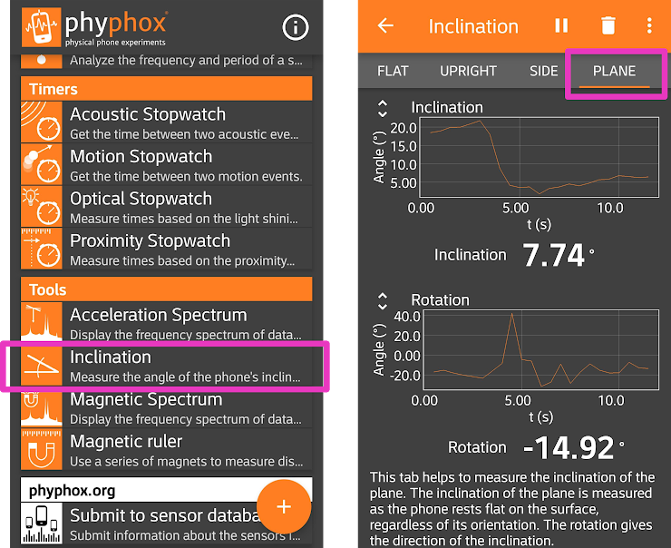

# Week 1: Exploratory Phase

--------------
1. [Background Reading](#background-reading)
2. [Formulating a Hypothesis](#formulating-a-hypothesis)
3. [Instrumentation](#instrumentation)
4. [Exploratory Measurements](#exploratory-measurements)
5. [Designing the Experiment](#designing-the-experiment)

--------------

We begin our investigation of measuring $$\mu_s$$ by doing an initial exploration. Our goal is to come up with a hypothesis to test and a plan for how we will do so (an experimental design). In the Exploratory Phase it can be especially important to take detailed notes. Organizing a digital lab notebook can be tricky, so for Module 1 we are providing a [template for you to follow along with in Google Classroom](https://docs.google.com/spreadsheets/d/1t7BDmQAXKmmr6LEs95xBj3y0d_Sd-gTzFa5BL0f9xmo/preview).

## Background Reading

Often the first step is to do some background reading and theoretical analysis. [This video from Prof. Saeta](https://youtu.be/EUT0F3k4asc?t=217) on how $$\mu_s$$ and $$\theta_c$$ are related will provide a quick refresher.

In your lab notebook, try the derivation yourself and document the result.

## Formulating a Hypothesis

We can now try to think of a hypothesis we can test with an experiment. As a quick check, according to the theory, which of factors will affect a measurement of $$\theta_c$$?

#### Mini-question

<iframe src="https://docs.google.com/forms/d/e/1FAIpQLSfsx8s07WCsCfoSiP2k2TAldJ-59ZFq16UpUFlPugfHGEq38w/viewform?embedded=true" width="640" height="300" frameborder="0" marginheight="0" marginwidth="0">Loading…</iframe>

-----

Based on this answer, try to come up with some hypotheses you could try to test. The theory makes specific predictions, and you can use those predictions to form the basis of a hypothesis. Post some of your ideas and check out others [on the "Hypotheses" note on Piazza](https://piazza.com/class/kdyuyniyaz052s?cid=7).

**For Module 1 we will all test the same hypothesis.** The hypothesis we will test is:

"The coefficient of static friction between two surfaces as measured by the critical angle at which an object slips is independent of its mass."

## Instrumentation

Now that we've decided what we hypothesis we are going to test, we need to figure out what equipment and experimental tools we are going to use. For this module, we are going to make use of whatever you have on hand. 

You will need a "block" and a "ramp" (e.g. a hard pencil case on a hardcover textbook) that satisfy the following requirements:

+ both items need to have flat, rigid surfaces
+ when you tilt the ramp, the block needs to slide without rolling or tipping
+ a way to add mass to the block without changing the surfaces in contact between the block and ramp

Share your ideas and check out what others are doing at [Piazza: Instrumentation for Module 1](https://piazza.com/class/kdyuyniyaz052s?cid=8).

To measure the angle we will use your phone or a tablet as the tool. Please go to https://phyphox.org (or to the app store on your device) and download the phyphox app. After downloading, find the "Inclination" tool and test that it works correctly with your phone.

Make note of your equipment in your lab notebook (record keeping is so important) and record any other notes you think might be helpful if someone else was trying to replicate your setup. 

## Exploratory Measurements

The exploratory measurements can be a fun part of the experimental process. You get to play around with your setup and make some observations! You can really let your curiosity and creativity guide you in this part of the experimental process. 

For your exploratory measurements in Module 1, we would like you to do the following:

+ Perform a single measurement to check that you are getting a reasonable answer

+ Get an understanding of the repeatability of your measurement 

+ Perform a preliminary test of your hypothesis

+ Check other factors that might affect your measurement (this is where you get to play!)

The steps below guide you through these four items, and provide links to important concepts (so please follow along carefully). Make sure you are recording your exploratory observations as you go so that you have a record of them.

#### 1. Perform a Single Measurement

Usually one of the first exploratory steps is to use your equipment to take a single measurement. We want to make sure that our measurement (in this case, $$\theta_c$$) will lead to a reasonable value of the calculated quantity we are trying to obtain ($$\mu_s$$). We also want to get a sense of the resolution of our measurement device and how that will affect the uncertainty measured in the calculated quantity. 

+ Place the block on the ramp and slowly raise the ramp while keeping an eye on the plane inclination measurement on the phyphox app. Record in the spreadsheet the value of the angle you observe just before slipping (in other words, perform a single measurement of $$\theta_c$$).

+ Read this [overview on uncertainties](uncertainty-introduction#overview) and also [about resolution uncertainty](uncertainty-introduction#resolution-uncertainty) ($$\approx$$ 5 minutes) first and then record the resolution uncertainty for the critical angle $\delta_\mathrm{res.} \theta_c$$ in your exploratory observations spreadsheet.

| $$\theta_c$$ (degrees) | $$\delta_\mathrm{res.} \theta_c $$ (degrees) |
|:-----------------------:|:---------------------------------------------:|
 | ...            |   ... |

+ Calculate $$\mu_s$$ from your single measurement of $$\theta_c$$ (using the relationship you derived in the [background reading](#background-reading)). 

*Friendly reminder: convert the angle from degrees to radians in your Google Sheet calculation.*

+ Learn how to propagate uncertainties from this video of [Prof. Gerbode explaining how to propagate uncertainty in $$\theta_c$$ to uncertainty in $$\mu_s$$](uncertainty-introduction#propagation-of-uncertainties) (10 minutes) and answer the mini-question about uncertainty propagation on that page. 

+  Calculate the resolution uncertainty in measuring the coefficient of static friction $$\delta_\mathrm{res.} \mu_s$$ by propagating your uncertainty $$\delta_\mathrm{res.} \theta_c$$. Derive any formulas you use in your lab notebook.

| $$\mu_s$$  | $$\delta_\mathrm{res.} \mu_s $$ |
|:-----------------------:|:---------------------------------------------:|
 | ...            |   ... |

Comment on whether your measured value is reasonable (e.g. is $$\mu_s$$ within the limits of allowable, i.e. between 0 and infinity?  With a quick google search, is it similar to $$\mu_s$$ for similar surfaces? Is your fractional resolution uncertainty reasonably small (fractional resolution uncertainty $$\equiv \frac{\delta_\mathrm{res.} \mu_s}{\mu_s}$$)?

*At this point, if your answer were to be unreasonable or you were unable to calculate the quantity you are interested in testing (in our case $$\mu_s$$), then it would be a good idea to carefully rethink your measurement. Doing this initial single measurement and check can save a lot of time, especially when the experimental setup gets more complicated as it will later in the course. If you're stuck, [post a question up on our Piazza site](https://piazza.com/class/kdyuyniyaz052s)*

#### 2. Test Repeatability

Now that we are confident we have a reasonable value of the quantity we are trying to measure, we should test the variability in our experimental measurement.

Read [this discussion about random uncertainty](uncertainty-introduction#random-uncertainty) 

The goal of testing repeatability is to get a sense of the random error associated with the measurement. 

Take a few measurements of $$\theta_c$$ under identical conditions (say 4 or 5). Make sure you "reset" your experimental setup each time: start the ramp from a horizontal position ($$\theta = 0$$), place the block onto the ramp, and then slowly start to raise the ramp. "Resetting" the experimental setup between trials helps to minimize systematic error, a major topic in Module II. 

Trial #	| $$\theta_c$$ (degrees)	
|:-------:|:-------------------------:|	
1 |			
2	|		
3	|		
4	|		

How does the spread in the data (maximum measured $$\theta_c$$ minus minimum $$\theta_c$$) compare to the resolution uncertainty?

If the spread in your data was representative of the standard deviation, how many data points would you need to take for the random uncertainty to equal your resolution uncertainty? 

#### Mini-question

<iframe src="https://docs.google.com/forms/d/e/1FAIpQLSeEwh4nclVo5lUZFmhBCM-n0td4vU4kPXocUJORmOVp1w2-Gg/viewform?embedded=true" width="640" height="300" frameborder="0" marginheight="0" marginwidth="0">Loading…</iframe>			

#### 3. Perform a preliminary test of the hypothesis

The goal of the preliminary test is to understand what challenges there might be to making a conclusion and have that inform your experiential design. The goal at this point is **not** to actually test the hypothesis or come to any conclusions yet!

Measure $$\theta_c$$ for a few different masses (choose the masses to cover as broad of a range as you have available)

mass (what units?) |$$\theta_c$$ (degrees)
|:-------:|:-------------------------:|	
 . |			
.	|		
 .	|		

	
	
How does the difference in $$\theta_c$$ for different masses compare to the difference in $$\theta_c$$ for the same mass (from testing repeatability)?

In this step, we are trying to get a rough sense of how big of an effect our independent variable (mass) might cause experimentally. The size of the effect will inform how many trials we might need to include in our experimental design. 

#### 4. Explore other factors

Finally, it's a good idea to explore other factors that might affect the measurement. These other factors might be a source of systematic error. Read about  [systematic error here first](uncertainty-introduction#random-uncertainty) (2 minutes).

Here are some ideas of things you can explore (feel free to explore others too):

- Try out different combinations of blocks/ramps
What combination of block/ramp might yield the best quality data?

- Do the following factors affect your measurement?
    - the exact location of where the block is placed on the ramp
    - speed of how quickly the ramp is raised
    - the direction the ramp is tilted
    - the orientation of the block 

If any of these factrors affect the measurement, which ones are most significant?

*Note: If we didn't already have a hypothesis in mind, we could use this exploration to help generate a hypothesis. If you have an idea that comes out of your exploration, be sure to share it [here on Piazza](https://piazza.com/class/kdyuyniyaz052s?cid=7)!* 

## Designing the Experiment

At the end of the exploratory observations, we can now complete an Experimental Design that will determine how the actual experiment will be performed. Think of 

Some questions to answer in your experimental design:

+ What hypothesis are you testing?

+ What is the detailed procedure for how you will obtain a measurement?

+ What independent variable(s) are you going to vary?

+ What factors are you going to control (hold constant)?

+ How many data points will you take? (Given the spread of your preliminary data, think about an acceptable random uncertainty to observe an effect)

+ In what order will you take the data points? (think about shuffling the order of data points you take)

+ Based on the data you will obtain, how will you test the hypothesis?

Write up your experimental design (save a copy for yourself) and then paste your design into the form below by the end of Week 1:

<iframe src="https://docs.google.com/forms/d/e/1FAIpQLSewMEb4a9mOoE5_sOsbKDLLZHV4bVxQuyFVwKdItmZiDfii0A/viewform?embedded=true" width="640" height="300" frameborder="0" marginheight="0" marginwidth="0">Loading…</iframe>

## Final Note

In the diagram at the top of the page, the arrows come full-circle and suggest that we may not be done. Although we have come up with an experimental design, we could return to some background reading to make sure that we are exploring hasn't been done already. We could, for example continue doing background reading to refine our experimental design and hypothesis by [searching Google Scholar for academic articles related to  our topic/hypothesis](https://scholar.google.com/scholar?q=critical+angle+and+the+coefficient+of+static+friction). The first search result, for example, measured $$\mu_s$$ for lubricated surfaces and found that the measured $$\mu_s$$ might depend on mass based on the type of lubricant. Although this type of hypothesis refinement frequently happens in experimental research, it is beyond the scope of our learning objectives in Physics 50. 

When you're ready, move on to [Week 2 - Hypothesis Testing Phase](week2-hypothesis-testing).