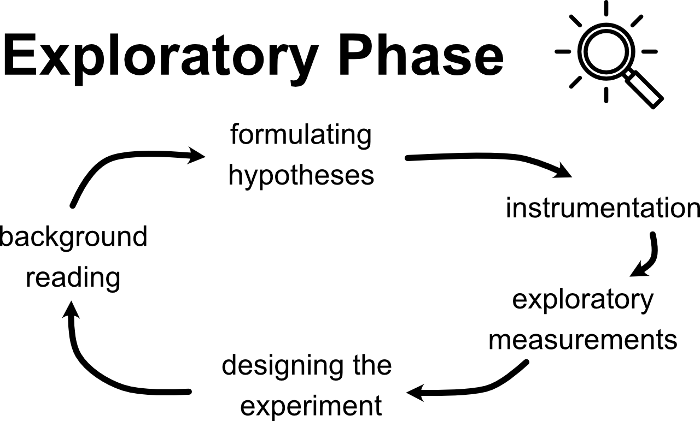

#### Miniquestion: MATLAB
*[Click here to open in a new tab](https://docs.google.com/forms/d/e/1FAIpQLSeasXUSl_nhqgLiacs6A5kVKMuBAeJtP4Ln4LsqXUoqP_cvyA/viewform?usp=sf_link){:target="_blank"}*

<iframe src="https://docs.google.com/forms/d/e/1FAIpQLSeasXUSl_nhqgLiacs6A5kVKMuBAeJtP4Ln4LsqXUoqP_cvyA/viewform?embedded=true" width="640" height="300" frameborder="10" marginheight="20" marginwidth="10">Loading…
</iframe>

--------------------------

# Week 2: Exploratory Phase (continued)

--------------
1. Background Reading
2. Formulating a Hypothesis
3. Instrumentation 
4. [Exploratory Measurements](#exploratory-measurements) (continued from Week 1)
5. [Designing the Experiment](#designing-the-experiment)

------------------

**Make sure you have your [Module 1 Data Sheet and Lab Notebook](https://classroom.google.com/c/MTI2NjQ0NDEyMTAx/a/MTI3ODQ4MDY2NDMx/details){:target="_blank"} handy as you go through the content on this Week 1 page.**

## Exploratory Measurements

#### 1 Perform a Single Measurement

From Week 1, you should have completed a single measurement of the critical angle and its resolution uncertainty $$\theta_c \pm \delta_\mathrm{res.}\theta_c$$. From that you propagated the uncertainty to calculate $$ \mu_s \pm \delta_\mathrm{res.} \mu_s$$, and concluded that your result was reasonable. If that isn't the case, please revisit [Week 1](week1) and [ask for help on Piazza](https://piazza.com/class/kdyuyniyaz052s){:target="_blank"} or [come to Office Hours](https://sakai.claremont.edu/portal/site/CX_mtg_130832/page/8bb99f43-12a4-4f97-8e47-802814328a26){:target=_"blank"}. 

#### 2 Perform a preliminary test of the hypothesis

The goal of the preliminary test is to understand what challenges there might be to making a conclusion and have that inform your experiential design. The goal at this point is **not** to actually test the hypothesis or come to any conclusions yet!

Remember our hypothesis for Module 1 is:

*"The coefficient of static friction between two surfaces as measured by the critical angle at which an object slips is independent of its mass."*

Perform a single measurement of $$\theta_c$$ for a few different masses (choose the masses to cover as broad of a range as you have available). Report whatever units you are using for the mass. This could be in grams if you have a scale available, but other unconventional units are okay too (e.g. mass in terms of the number of tuna cans or whatever object you are using as the block).

mass (what units?) |$$\theta_c$$ (degrees)
|:-------:|:-------------------------:|	
 . |			
.	|		
 .	|		

		

In this step, we are trying to get a rough sense of how big of an effect our independent variable (mass) might cause experimentally. The size of the effect will inform what amount of experimental uncertainty will allow us to draw a strong conclusion. 

How does the difference in $$\theta_c$$ for different masses compare to the resolution uncertainty of your measurement?

#### 3 Test Repeatability

Now that we are confident we have a reasonable value of the quantity we are trying to measure, and have some sense of how large the effect we are trying to measure might be, we should test the variability in our experimental measurement.

Read [this discussion about random uncertainty](uncertainty-introduction#random-uncertainty) 

The goal of testing repeatability is to get a sense of the random error associated with the measurement. 

Take a few measurements of $$\theta_c$$ under identical conditions (say 4 or 5). Make sure you "reset" your experimental setup each time: start the ramp from a horizontal position ($$\theta = 0$$), place the block onto the ramp, and then slowly start to raise the ramp. "Resetting" the experimental setup between trials helps to minimize systematic error, a major topic in Module II. 

Trial #	| $$\theta_c$$ (degrees)	
|:-------:|:-------------------------:|	
1 |			
2	|		
3	|		
4	|		

From this preliminary test of repeatability, we would like to get an idea of what the variance of our distribution of measurements might be. With only a few datapoints, calculating the standard deviation will probably not give an accurate reflection of the underlying distribution. So let's take a conservative estimate of how random our dataset is by using the "spread" in the data: the maximum minus minimum value we measured.

+ How does the spread in the data (maximum measured $$\theta_c$$ minus minimum $$\theta_c$$) compare to the resolution uncertainty? 
    + Based on this, what should we focus on: improving our instrumentation (reducing resolution uncertainty) or taking many repeated trials (reducing our random uncertainty)?

 Assuming this spread approximates our standard deviation $$\sigma$$, let's use this to estimate how many trials we might need to reach a desired random uncertainty (standard error of the mean). Remember $$\textrm{SEM} = \sigma/\sqrt{N}$$. 

| Desired random uncertainty / standard error of the mean (degrees) |	Number of trials likely required per datapoint|
|:-----------------:|:------------------:|
| 2 |	|
| 1	 | |
| 0.5 |	|
| 0.1	| |
| 0.01	|| 

+ How many data points would you need to take in order for any effect due to changing mass to be larger than your random uncertainty? 

Remember our goal is to make the strongest conclusion we can, which involves minimizing the experimental uncertainty. But more trials will take more time to perform,and there are diminishing returns to taking more datapoints. There is no right answer for balancing these two, but decide on the number of datapoints you will take and explain your reasoning in your experimental design.

#### Miniquestion: How Many Trials
*[Click here to open in a new tab](https://docs.google.com/forms/d/e/1FAIpQLSeEwh4nclVo5lUZFmhBCM-n0td4vU4kPXocUJORmOVp1w2-Gg/viewform){:target="_blank"}*

<iframe src="https://docs.google.com/forms/d/e/1FAIpQLSeEwh4nclVo5lUZFmhBCM-n0td4vU4kPXocUJORmOVp1w2-Gg/viewform?embedded=true" width="640" height="300" frameborder="0" marginheight="0" marginwidth="0">Loading…
</iframe>

#### 4 Explore Other Factors

Finally, it's a good idea to explore other factors that might affect the measurement. These other factors might be a source of systematic error. Read about  [systematic error here first](uncertainty-introduction#systematic-errors) (2 minutes).

Here are some ideas of things you can explore (feel free to explore others too):

- Try out different combinations of blocks/ramps
What combination of block/ramp might yield the best quality data?

- Do the following factors affect your measurement?
    - the exact location of where the block is placed on the ramp
    - speed of how quickly the ramp is raised
    - the direction the ramp is tilted
    - the orientation of the block 

If any of these factors affect the measurement, which ones are most significant?

*Note: If we didn't already have a hypothesis in mind, we could use this exploration to help generate a hypothesis. If you have an idea that comes out of your exploration, be sure to share it [here on Piazza](https://piazza.com/class/kdyuyniyaz052s?cid=7){:target="_blank"}!* 

## Designing the Experiment

At the end of the exploratory observations, we can now complete an Experimental Design that will determine how the actual experiment will be performed. 

Some questions to answer in your experimental design:

+ What hypothesis are you testing? (for Module 1 it's "The coefficient of static friction between two surfaces as measured by the critical angle at which an object slips is independent of its mass.")

+ What is the detailed procedure for how you will obtain a measurement?

+ What independent variable(s) are you going to vary?

+ What factors are you going to control (hold constant)?

+ How many data points will you take? (Given the spread of your preliminary data, think about an acceptable random uncertainty to observe an effect. You should follow a similar approach to the "How Many Trials" mini-question to make this estimate).

+ In what order will you take the data points? (think about shuffling the order of data points you take)

+ Based on the data you will obtain, how will you test the hypothesis?

## Checkpoint 2

+ Write up your experimental design (save a copy for yourself) and then paste your design into [checkpont 2 on Gradescope](https://www.gradescope.com/courses/165932/assignments/607633){:target="_blank"} by the end Week 2.

+ And to double-check, make sure you have finished all of this week's mini-questions by [checking here](mini-questions#week-2){:target="_blank"}

## Final Note

In the diagram at the top of the page, the arrows come full-circle and suggest that we may not be done. Although we have come up with an experimental design, we could return to some background reading to make sure that we are exploring hasn't been done already. We could, for example continue doing background reading to refine our experimental design and hypothesis by [searching Google Scholar for academic articles related to  our topic/hypothesis](https://scholar.google.com/scholar?q=critical+angle+and+the+coefficient+of+static+friction). The first search result, for example, measured $$\mu_s$$ for lubricated surfaces and found that the measured $$\mu_s$$ might depend on mass based on the type of lubricant. Although this type of hypothesis refinement frequently happens in experimental research, it is beyond the scope of our learning objectives in Physics 50. 

When you're ready, move on to Week 3 - Hypothesis Testing Phase.

