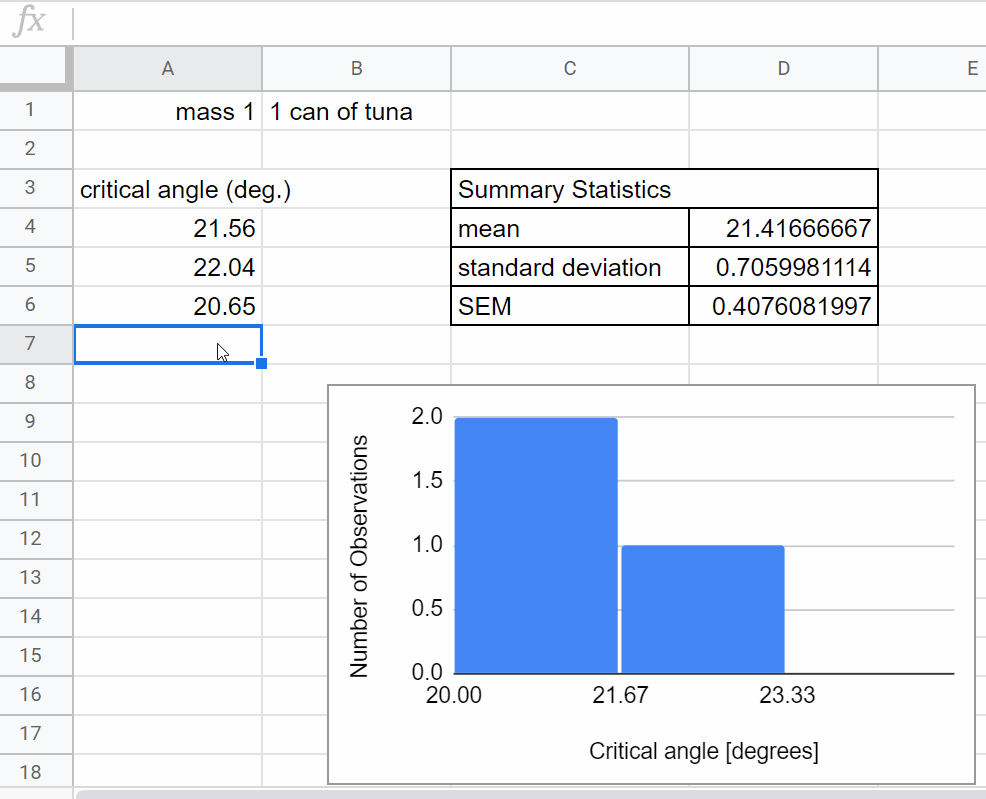

# Week 3: Generating Data to Test a Hypothesis

This week we are going to generate a data set to test our hypothesis. This will include more detailed data collection for analysis than the exploratory measurement from Weeks 1-2.

[Background Reading for Week 3](#background-reading-and-miniquestions)

[Data Collection for Week 3](#data-collection)

## Background Reading and Miniquestions

At the end of this week you should have a complete data set for the measured critical angle for (at least) two different masses.

Before you begin taking data, there are two principles that we would like to introduce: **"real-time data visualization"** and **"iterative experimental design"**. In taking experimental data, we don't want to just blindly follow the procedure laid out in the experimental design. We need to ensure the data we are taking is reasonable and that our conclusions are well-founded and impactful. One way to do ensure the data is reasonable is to have some real-time visualization set up ("plotting as you go"). That way we can see our data as we are taking it, and adapt based on any new information.

*Warning* When "plotting as we go" we don't want to make a real-time decision that incorrectly shapes our conclusions. For example, suppose we had made a plan to take 10 data points based on our exploratory measurements. But in taking the first 3 data points we notice a small sample standard deviation and that if we just stop taking data now, we end up with a reasonable conclusion. If we stop our hypothesis testing based on whether or not the data gives us the answer we are looking for, then we might engaging in a "Questionable Research Practice" ([explained here](https://replicationindex.com/2015/01/24/questionable-research-practices-definition-detect-and-recommendations-for-better-practices/){:target="_blank"} and [related xkcd](https://www.explainxkcd.com/wiki/index.php/882:_Significant){:target="_blank"}).

To provide some separation between our experimental decisions and our hypothesis testing, we will iterate on our experimental design. It's okay to change your plan if it turned out to be a bad one. But we want to provide some justification for any changes we make to our initial plan. Here we will provide more details about the two principles we will employ this week, **"real-time data visualization"** and **"iterative experimental design"**. We encourage you to refer back to them as you undertake your detailed data collection.

### Real-time Data Visualization

An important habit we would like you to develop as an experimentalist is to be plotting/visualizing your data as you take it. Even though you made a plan with your experimental design, there are many unexpected things that can happen. You should set up your data collection (e.g. in Google Sheets) so that recording each data point automatically updates a plot with your data and calculates statistical quantities (sample mean, sample standard deviation, and standard error of the mean). Here are some things to keep an eye out for as your taking your data:

+ Is your sample mean very different than what you measured in your exploratory analysis? 
    + If so, then try to troubleshoot what the differences might be (e.g. a calculation error, an uncontrolled variable), and then revise your approach
+ Is your sample standard deviation much larger than what you found in your exploratory analysis? 
    + If so, then maybe you need to revise how many data points you plan on taking
+ Does your data look Normally-Distributed* (like a Gaussian, bell-curve)?
    + If not, then you should try to investigate uncontrolled variables or perhaps increase the number data points of your experimental design
    
    **Note: if you have taken only a few data points, you shouldn't expect your data to look like it's Normally-Distributed, even if it was being sampled from a Normal distribution. Make sure you take enough data before checking if it's Normally-Distributed*

---------------------------------

#### Miniquestion: Making an experimental plan
[*Click here to open in a new tab*](https://forms.gle/dUEeSjauPuXdWdGQA){:target="_blank"}

<iframe src="https://docs.google.com/forms/d/e/1FAIpQLSfN0ZrJe3JAKf4JEn8enzzwZxvwE8q9wmX03lc_p4ojOMC0jQ/viewform?embedded=true" width="640" height="300" frameborder="0" marginheight="0" marginwidth="0">Loading…
</iframe>

-------------------

### Iterative Experimental Design

If your real-time data visualization indicates something is going wrong, you should iterate on your experimental design. Sometimes this is just as simple as making a note in your lab notebook of the revised plan. For example, *"The first 5 data points had sample standard deviation larger than what was observed in the exploratory measurement. Instead of 10 data points, I will now take 20."*

Or maybe you've noticed some uncontrolled factor in your experiment and you need to start over. In that case, carefully note any data that was taken, but do not delete it! Even if you aren't going to include data you've taken in your analysis it's important to keep a record of what happened. Here's an example: *"My experimental design called for 10 data points, but in my first 5 data points I noticed a larger standard deviation than I expected based on my exploratory measurements. I noticed that the pencils inside my hard pencil case (used as the block) were sometimes shifting inside the pencil case before the pencil case was slipping on my book (the ramp). The first 5 trials were taken without carefully controlling that factor, and I will not include them in my analysis. In subsequent trials, I will make sure the pencils are pushed up against the "downhill" side of the pencil case before starting. I will take 10 new data points according to my experimental design."*

But often even if things go as planned and we finish taking data according to our experimental design, we can end up with an inconclusive or unclear result. Just because you complete your experimental design, doesn't mean you are done with your experiment! It's far easier to communicate your results when there is a clear conclusion. So it's often worth the effort to revise your plan and take more data, which will save you time trying to communicate your results (which we will do in Week 4).

As an experimentalist, you have to make the tough decision of when the experiment is complete. It takes years to build up the knowledge and intuition to comfortably decide "when am I done?". Even collaborators in the same research group can disagree on this point. To help get you started, let's look at a few examples in the following miniquestion. 

-------

#### Miniquestion: Iterative Experimental Design
[*Click here to open in a new tab*](https://forms.gle/NcgosyMdDvaTssni6){:target="_blank"}
<iframe src="https://docs.google.com/forms/d/e/1FAIpQLSfbfx5oJyy117QD2xn4THhV6s-pbtv_T4cbtJFu0922d46eMw/viewform?embedded=true" width="640" height="600" frameborder="0" marginheight="0" marginwidth="0">Loading…
</iframe>

-----
## Week 3 - Generating Data to Test a Hypothesis

## Data Collection

### Step 1: Set-up a Spreadsheet
Your spreadsheet should allow you to:
+ Record data.
+ Plot your data in real time.
+ Analyze your data. In this case your goal is to determine the co-efficient of static friction for each mass.

Look back to the spreadsheet you used for your preliminary data collection last week. You will want to organize your data collection in a similar way. 

Click here for detailed steps to guide you through the process of setting up your spreadsheet

These steps will guide you through this process:

1. Begin by creating a worksheet. This can be a new sheet in your existing worksheet using the add sheet button in the bottom left or a new worksheet.
2. Set up a table to determine the critical angle for the first mass.

    + Give the table a title.

    + Title the column you will be using for data collection ($$\theta_c$$)

    + As part of the Experimental Design you prepared for the week #2 checkpoint you estimated a reasonable number of data points to achieve the desired accuracy. Use this as a guide for how many rows to include in your table. 

    + Use the borders feature to outline the table.
    
        

3. Set up a graph to plot your data in real time. For this experiment you will want to plot a histogram of your measurements of the the critical angle $$\theta_c$$. Today we are setting up an informal plot to look at our data in real time. This is different from a more formal figure that you would use to share/communicate your results - creating formal figures is a more careful process, we will do that next week after we've collected and reflected on our data. Here we summarize how to create a histogram in sheets. You can find more helpful information at: [*Click here to open in a new tab*](https://support.google.com/docs/answer/9146867?hl=en){:target="_blank"}

    + You can add a chart by selecting "insert" and then "chart" from the drop down menus.

    + A new "Chart Editor" Menu will appear on the RHS of the screen. Use the drop down menu under chart type to select "histogram".

        

    + On the next line of the "Chart Editor" set data range to be the cells in which you plan to insert your data (you may have to go back and edit this later if you collect more data than expected)

    + Press the x in the top right to exit the chart editor.

    + Click on your chart and move it to a convenient spot in your worksheet. You will want to customize the chart further once you begin collecting data.

5. Now add a row to calculate the average value for the critical angle, $$\theta_c$$ and standard error. This will be analogous to what you did last week just with more data, go ahead and look back to last week's worksheet to set-up the calculations.

6. Add another row to use the same calculations you did last week to calculate the coefficient of static friction, $$\mu_s$$, for your new data set.

7. Finally duplicate the sheet. At the bottom left are tabs that allow you to have multiple sheets in your worksheet. If you click on the downward arrow next to your sheet name a menu will appear. Click on "duplicate" and you will now have a second identical sheet ready for data from your second mass. You can rename your sheets from the same menu.
 

Once you have collected a few data points you will want to go back to the chart editor and select customize. Next week we will focus on polishing our plot for communicating our results but even for your own records you want to make a few adjustments while collecting data. 

+ Use the Chart and axis title dropdown to add a chart title

+ Within the same dropdown menu, if you click on chart title you can change the dropdown to "Horizontal axis title". Go ahead and label your axis.

+ The histogram dropdown will allow you to change the bucket size (by default it will be on auto which you may or may not find satisfactory depending on your data)

----------------------------------

### Step 2: Collect and analyze data

Make sure to record all relevant details such as what mass you are using. Always include units when recording data. If you are switching back and forth between the masses to randomize your experiment, then be very careful about where in your spreadsheet you are recording your data.  

As you collect data, be on the lookout for problems like those mentioned in the [Real-time Data Visualization](#real-time-data-visualization) section above. The histogram and summary statistics of your critical angle will help you identify if you need to adjust your plan.

### Step 3: Reflect and Iterate

It is important to take a moment to reflect on your results. Are there any anomalies in your data? (This is often a reason to collect more data). Are your final results and uncertainties reasonable? How do your results compare with your hypothesis.

At this point, you need to consider if your results are conclusive. Review the section [Iterative Experimental Design](#iterative-experimental-design) above. If your results are inconclusive, then can you think of some reasonable* steps that you can take to improve your measurement? If so, then come up with a revised experimental plan and try it!

**Reasonable is subjective. We don't expect for the purposes of our Module 1 that you will take hundreds of data points. But if taking 10 more data points will result in a stronger conclusion, then we encourage you to do so!*

## Checkpiont #3

Please submit the following to Checkpoint #3 on Gradescope

+ A screen-shot showing an organized spreadsheet used for data collection

+ Two histograms showing the number of data points measured as a function of the angle $$\theta_c$$

+ The value you obtained for the coefficient of static friction, $$\mu_s$$, for each mass, including the estimated uncertainty.