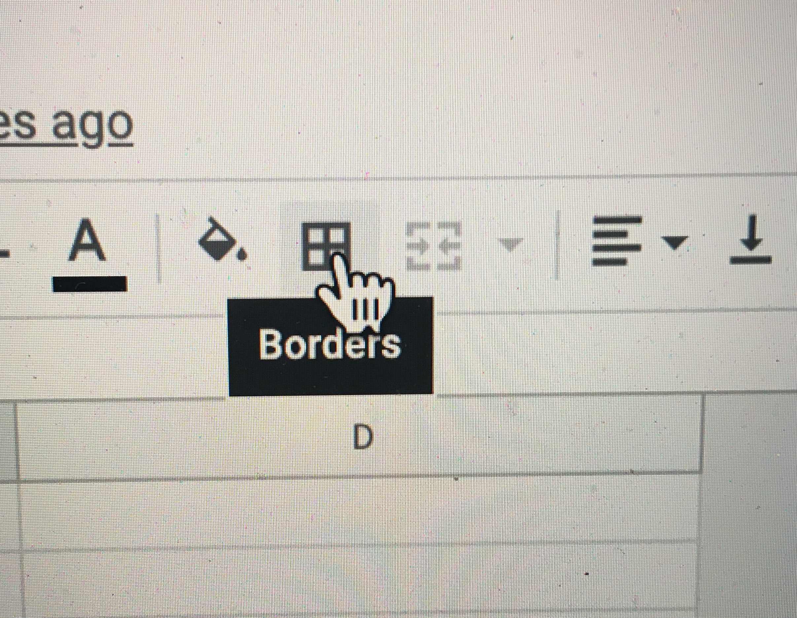
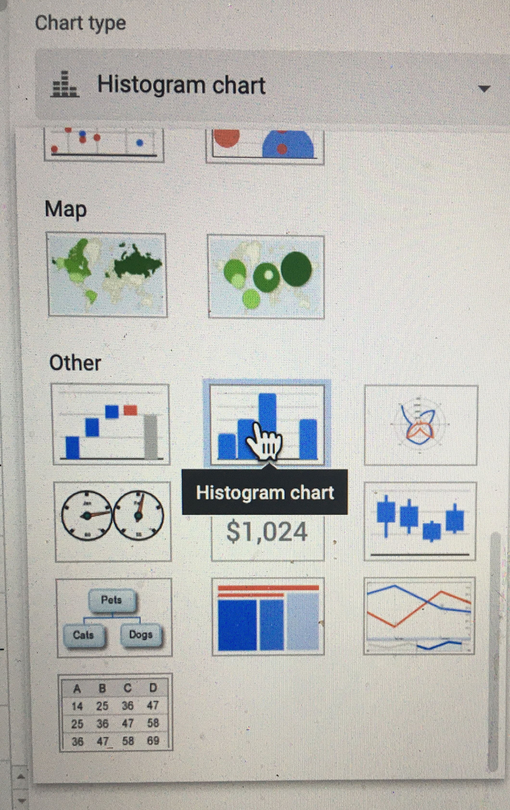

# Week 3: Generating Data to Test a Hypthesis
This week we are going to generate a data set to test our hypothesis. This will include more detailed data collection for analysis than last week's quick test.

At the end of this week you should have a complete data set for the measured critical angle for two different masses.

## Step 1: Set-up a Spreadsheet
Your spreadsheet should allow you to:
1. Record data
2. Plot your data in real time. This is essential to guide choices during data collection. In this case we will plot our data as a histogram.
3. Analyze your data. In this case your goal is to determine the co-efficient of static friction for each mass.

Look back to the spreadsheet you used for your preliminary data collection last week. You will want to organize your data collection in a similar way. These steps will guide you through this process:

1. Take a careful look at the spreadsheet we provided. Think about how it is organized: e.g. division into sections and headings for both sections and data columns. To make the most of your worksheets they need to be organized.
2. Begin by creating a worksheet. This can be a new sheet in your existing worksheet using the add sheet button in the bottom left or a new worksheet.
3. Set up a table to determine the critical angle for the first mass.

    i. Give the table a title.

    ii. Use the borders feature to outline the table.
    
    

4. Set up a graph to plot your data in real time. For this experiment you will want to plot a histogram of your measurements of the the critical angle $$\theta_c$$. Today we are setting up an informal plot to look at our data in real time. This is different from a more formal figure that you would use to share/communicate your results - creating formal figures is a more careful process, we will do that next week after we've collected and reflected on our data.

    i. You can add a chart by selecting "insert" and then "chart" from the drop down menus.

    ii. A new "Chart Editor" Menu will appear on the RHS of the screen. Use the drop down menu under chart type to select "histogram".

    
    
**Add details for setting up histogram

5. Now add a line to calculate the average value for the critical angle, $$\theta_c$$ and standard error. This will be analogous to what you did last week just with more data, go ahead and look back to last week's worksheet to set-up the calculations.

6. Add another line to use the same calculations you did last week to calculate the coefficient of static friction, $$\mu_s$$, for your new data set.

7. Finally duplicate the sheet
*** add instructions
so that your spreadsheet is already set-up for your second mass.

## Step 2: Collect and analyze data

Your real-time histogram should guide you in determining when you have enough data. You should have a histogram with enough data that you feel you have a reasonable estimate of the mean and its uncertainty. Remember, our goal is to compare the results we obtain from two different masses in order to test our hypothesis. We would like to determine whether or not the results are equivalent to within our experimental error we need to accurately estimate that experimental error. We would also like to reduce the uncertainty as much as possible to make this a more meaningful experiment.

Once you are happy with your histgram for the first mass, switch to the second tab and collect data for the second mass.

## Step 3:Reflection

It is important to take a mooment to reflect on your results. Are there any anomolies in your data? (This is often a reason to collect more data). Are your final results and uncertainties reasonable? How do your results compare with your hypothesis.

## Checkpiont #3